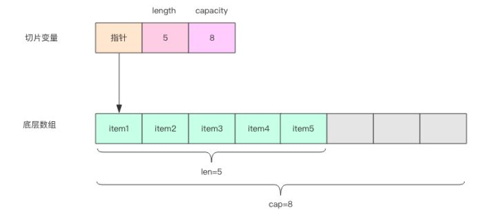
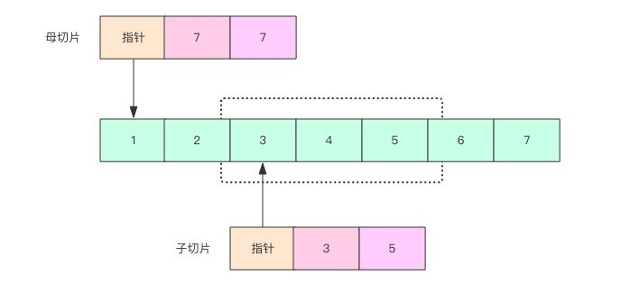
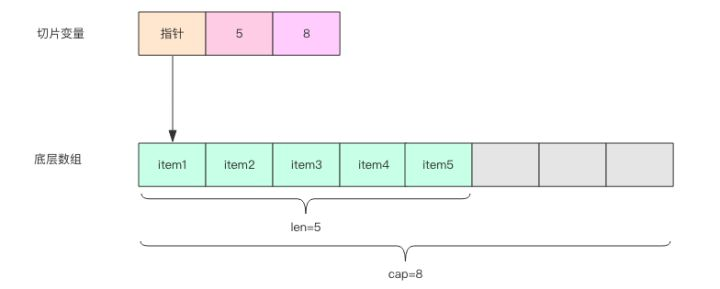

# 07Slice灵活的切片


切片无疑是 Go 语言中最重要的数据结构，也是最有趣的数据结构，它的英文词汇叫 slice。

学过 Java 语言的人会比较容易理解切片，因为它的内部结构非常类似于 ArrayList，ArrayList 的内部实现也是一个数组。

当数组容量不够需要扩容时，就会换新的数组，并且将老数组的内容拷贝到新数组。ArrayList 内部有两个非常重要的属性 capacity 和 length。

capacity 表示内部数组的总长度，length 表示当前已经使用的数组的长度。length 永远不能超过 capacity。



上图中一个切片变量包含三个域，分别是底层数组的指针、切片的长度 length 和切片的容量 capacity。

切片支持 append 操作可以将新的内容追加到底层数组，也就是填充上面的灰色格子。如果格子满了，切片就需要扩容，底层的数组就会更换。

形象一点说，切片变量是底层数组的视图，底层数组是卧室，切片变量是卧室的窗户。通过窗户我们可以看见底层数组的一部分或全部。一个卧室可以有多个窗户，不同的窗户能看到卧室的不同部分。


## 切片的创建

* 方法一、使用内置函数make创建切片

```go
package main

import "fmt"

func main() {
	var s1 []int = make([]int, 5, 8)
	var s2 []int = make([]int, 8) //满容切片:length和capacity相等；
	fmt.Println(s1)
	fmt.Println(s2)
}
```

make 函数创建切片，需要提供三个参数，分别是切片的类型、切片的长度和容量。其中第三个参数是可选的，如果不提供第三个参数，那么长度和容量相等，也就是说切片是满容的。

切片和普通变量一样，也可以使用类型自动推导，省去类型定义以及 var 关键字。

上面的代码和如下代码是等价的：

```go
package main

import "fmt"

func main() {
	var s1 = make([]int, 5, 8)
	s2 := make([]int, 8)
	fmt.Println(s1)
	fmt.Println(s2)
}
```

## 切片的初始化：

使用 make 函数创建的切片内容是「零值切片」，也就是内部数组的元素都是零值。

Go 语言还提供了另一种创建切片的语法，允许我们给它赋初值。使用这种方式创建的切片是满容的。

```go
package main

import "fmt"

func main() {
    var s []int = []int{1,2,3,4,5}   // 满容的
    fmt.Println(s,len(s),cap(s))
}
```

* Go 语言提供了内置函数 len() 和 cap() 可以直接获得切片的长度和容量属性。

## 空切片：

在创建切片时，还有两个非常特殊的情况需要考虑，那就是容量和长度都是零的切片，叫着「空切片」，这个不同于前面说的「零值切片」。

```go
package main

import "fmt"

func main() {
	var s1 []int
	var s2 []int = []int{}
	var s3 []int = make([]int, 0)

	fmt.Println(s1, s2, s3)
	fmt.Println(len(s1), len(s2), len(s3))
	fmt.Println(cap(s1), cap(s2), cap(s3))
}
```

上面三种形式创建的切片都是「空切片」，不过在内部结构上这三种形式是有差异的，甚至第一种都不叫「空切片」，而是叫着「 nil 切片」。

但是在形式上它们一摸一样，用起来没有区别。所以初级用户可以不必区分「空切片」和「 nil 切片」

## 切片的赋值：

切片的赋值是一次浅拷贝操作，拷贝的是切片变量的三个域，你可以将切片变量看成长度为 3 的 int 型数组，数组的赋值就是浅拷贝。

拷贝前后两个变量共享底层数组，对一个切片的修改会影响另一个切片的内容，这点需要特别注意。

```go
package main

import "fmt"

func main() {
	var s1 = make([]int, 5, 8)
	// 切片的访问和数组差不多
	for i := 0; i < len(s1); i++ {
		s1[i] = i + 1
	}
	var s2 = s1 // 浅拷贝

	fmt.Println(s1, len(s1), cap(s1))
	fmt.Println(s2, len(s2), cap(s2))

	// 尝试修改切片内容
	s2[0] = 255
	fmt.Println(s1)
	fmt.Println(s2)

	/*
		[1 2 3 4 5] 5 8
		[1 2 3 4 5] 5 8
		[255 2 3 4 5]
		[255 2 3 4 5]
		// 对s2[0]的修改，影响了s1[0]的值，说明s1和s2共享了底层数组；
	*/
}
```

## 切片的遍历

切片在遍历的语法上和数组是一样的，除了支持下标遍历外，那就是使用 range 关键字.

```go
package main

import "fmt"

func main() {
	var s = []int{1, 2, 3, 4, 5}
	for i := 0; i < len(s); i++ {
		fmt.Println(i, s[i])
	}

	for index := range s {
		fmt.Println(index, s[index])
	}

	for index, value := range s {
		fmt.Println(index, value)
	}
}
```

## 切片的追加

切片是动态的数组，其长度是可以变化的。

什么操作可以改变切片的长度呢，这个操作就是追加操作。

切片每一次追加后都会形成新的切片变量，如果底层数组没有扩容，那么追加前后的两个切片变量共享底层数组，如果底层数组扩容了，那么追加前后的底层数组是分离的不共享的。

如果底层数组是共享的，一个切片的内容变化就会影响到另一个切片，这点需要特别注意。

```go
package main

import "fmt"

func main() {
	var s1 = []int{1, 2, 3, 4, 5}
	fmt.Println(s1, len(s1), cap(s1))

	// 对满容的切片进行追加会分离底层数组
	var s2 = append(s1, 6)
	fmt.Println(s1, len(s1), cap(s1))
	fmt.Println(s2, len(s2), cap(s2))

	// 对非满容的切片进行追加会共享底层数组
	var s3 = append(s2, 7)
	fmt.Println(s2, len(s2), cap(s2))
	fmt.Println(s3, len(s3), cap(s3))

	/*
		运行结果：
		[1 2 3 4 5] 5 5

		[1 2 3 4 5] 5 5
		[1 2 3 4 5 6] 6 10  // s2在s1的基础上进行扩容，容量翻倍，此时s2是 非满容切片；

		[1 2 3 4 5 6] 6 10
		[1 2 3 4 5 6 7] 7 10  // s3在s2的基础上append元素，只会增加length，因为s2非满容；
	*/
}
```

正是因为切片追加后是新的切片变量，Go编译器禁止追加了切片后不使用这个新的切片变量，以避免用户以为追加操作的返回值和原切片变量是同一个变量。

```go
package main

import "fmt"

func main() {
 var s1 = []int{1,2,3,4,5}
 append(s1, 6)
 fmt.Println(s1)
}

--------------
./main.go:7:8: append(s1, 6) evaluated but not used
```

如果你真的不需要使用这个新的变量，可以将 append 的结果赋值给下划线变量。

下划线变量是 Go 语言特殊的内置变量，它就像一个黑洞，可以将任意变量赋值给它，但是却不能读取这个特殊变量。

```go
package main

import "fmt"

func main() {
 var s1 = []int{1,2,3,4,5}
 _ = append(s1, 6)
 fmt.Println(s1)
}

----------
[1 2 3 4 5]
```

还需要注意的是追加虽然会导致底层数组发生扩容，更换的新的数组，但是旧数组并不会立即被销毁被回收，因为老切片还指向这旧数组。


## 切片的域是只读的

我们刚才说切片的长度是可以变化的，为什么又说切片是只读的呢？这不是矛盾么?

切片追加后形成了一个新的切片变量，而老的切片变量的三个域其实并不会改变，改变的只是底层的数组。

这里说的是切片的「域」是只读的，而不是说切片是只读的。切片的「域」就是组成切片变量的三个部分，分别是底层数组的指针、切片的长度和切片的容量。

## 切割切割

切片的切割可以类比字符串的子串，它并不是要把切片割断，而是从母切片中拷贝出一个子切片来，子切片和母切片共享底层数组。

```go
package main

import "fmt"

func main() {
	var s1 = []int{1, 2, 3, 4, 5, 6, 7}
	// start_index 和 end_index 不包含 end_index
	// [start_index:end_index]
	var s2 = s1[2:5]
	fmt.Println(s1, len(s1), cap(s1))
	fmt.Println(s2, len(s2), cap(s2))
}

/*
---------------------
[1 2 3 4 5 6 7] 7 7
[3 4 5] 3 5
*/
```

* 问题： 切割前后共享底层数组，那为什么容量不一样呢？



子切片的内部数据指针指向了数组的中间位置，而不再是数组的开头了。

子切片容量的大小是从中间的位置开始直到切片末尾的长度，母子切片依旧共享底层数组。


* 子切片语法上要提供起始和结束位置，这两个位置都可选的，不提供起始位置，默认就是从母切片的初始位置开始（不是底层数组的初始位置），不提供结束位置，默认就结束到母切片尾部（是长度线，不是容量线）。

```go
package main

import "fmt"

func main() {
	var s1 = []int{1, 2, 3, 4, 5, 6, 7}
	var s2 = s1[:5]
	var s3 = s1[3:]
	var s4 = s1[:]

	fmt.Println(s1, len(s1), cap(s1))
	fmt.Println(s2, len(s2), cap(s2))
	fmt.Println(s3, len(s3), cap(s3))
	fmt.Println(s4, len(s4), cap(s4))

	/*
	   -----------------------
	   [1 2 3 4 5 6 7] 7 7
	   [1 2 3 4 5] 5 7
	   [4 5 6 7] 4 4
	   [1 2 3 4 5 6 7] 7 7
	*/
}
```

s1[:] 很特别，它和普通的切片赋值有区别么？答案是没区别，这非常让人感到意外，同样的共享底层数组，同样是浅拷贝。验证一下：

```go
package main

import "fmt"

func main() {
 var s = make([]int, 5, 8)
 for i:=0;i<len(s);i++ {
  s[i] = i+1
 }
 fmt.Println(s, len(s), cap(s))

 var s2 = s
 var s3 = s[:]
 fmt.Println(s2, len(s2), cap(s2))
 fmt.Println(s3, len(s3), cap(s3))

 // 修改母切片
 s[0] = 255
 fmt.Println(s, len(s), cap(s))
 fmt.Println(s2, len(s2), cap(s2))
 fmt.Println(s3, len(s3), cap(s3))
}

/*
运行结果：
-------------
[1 2 3 4 5] 5 8
[1 2 3 4 5] 5 8
[1 2 3 4 5] 5 8
[255 2 3 4 5] 5 8
[255 2 3 4 5] 5 8
[255 2 3 4 5] 5 8
*/
```

go对索引的操作，不像python那样支持索引为负数。（索引不能为负数）

## 数组变切片

对数组进行切割可以转换成切片，切片将原数组作为内部底层数组。也就是说修改了原数组会影响到新切片，对切片的修改也会影响到原数组。

```go
package main

import "fmt"

func main() {
	var a = [10]int{1, 2, 3, 4, 5, 6, 7, 8, 9, 10}
	var b = a[2:6]
	fmt.Println(b)
	a[4] = 100      // 因为b使用的a作为底层数组，所以b也受影响；
	fmt.Println(b)
}
```

## copy函数

Go 语言还内置了一个 copy 函数，用来进行切片的深拷贝。

不过其实也没那么深，只是深到底层的数组而已。

如果数组里面装的是指针，比如 []*int 类型，那么指针指向的内容还是共享的。

```go
func copy(dst, src []T) int
```

copy 函数不会因为原切片和目标切片的长度问题而额外分配底层数组的内存，它`只负责拷贝数组的内容，从原切片拷贝到目标切片，拷贝的量是原切片和目标切片长度的较小值 —— min(len(src), len(dst))，函数返回的是拷贝的实际长度。`


```go
package main 

import "fmt"

func main() {
	var s = make([]int,5,8)
	for i := 0; i < len(s); i++ {
		s[i] = i+1
	}
	fmt.Println(s)

	var d = make([]int,2,6)
	var n = copy(d,s)    // 返回的是2，n=2
	fmt.Println(n,d)
}
```

## 切片的扩容点

当比较短的切片扩容时，系统会多分配 100% 的空间，也就是说分配的数组容量是切片长度的2倍。但切片长度超过1024时，扩容策略调整为多分配 25% 的空间，这是为了避免空间的过多浪费。试试解释下面的运行结果。

```go
package main

import "fmt"

func main() {
	s1 := make([]int, 6)
	s2 := make([]int, 1024)
	s1 = append(s1, 1)
	s2 = append(s2, 2)
	fmt.Println(len(s1), cap(s1))
	fmt.Println(len(s2), cap(s2))
}

/*
-------------------------
7 12
1025 1280
*/
```

扩容是一个比较复杂的操作，内部的细节必须通过分析源码才能知晓，不去理解扩容的细节并不会影响到平时的使用，

---

## 切片的三种特殊状态：

* 1.零切片
* 2.空切片
* 3.nil切片



切片的底层是一个数组，切片的表层是一个包含三个变量的结构体，当我们将一个切片赋值给另一个切片时，本质上是对切片表层结构体的浅拷贝。

结构体中第一个变量是一个指针，指向底层的数组，另外两个变量分别是切片的长度和容量。

```go
type slice struct {
  array unsafe.Pointer
  length int
  capcity int
}
```

「零切片」其实并不是什么特殊的切片，它只是表示底层数组的二进制内容都是零。比如下面代码中的 s 变量就是一个「零切片」.

```go
var s = make([]int, 10)
fmt.Println(s)
------------
[0 0 0 0 0 0 0 0 0 0]
```

如果是一个指针类型的切片，那么底层数组的内容就全是 nil

```go
var s = make([]*int, 10)
fmt.Println(s)
------------
[<nil> <nil> <nil> <nil> <nil> <nil> <nil> <nil> <nil> <nil>]
```

* 长度为零的切片都有那些形式可以创建出来?

```go
package main

import "fmt"

func main() {
	var s1 []int
	var s2 = []int{}
	var s3 = make([]int, 0)

	// new函数返回的是指针类型，所以需要使用 * 号来解引用；
	var s4 = *new([]int)

	fmt.Println(len(s1), len(s2), len(s3), len(s4))
	fmt.Println(cap(s1), cap(s2), cap(s3), cap(s4))
	fmt.Println(s1, s2, s3, s4)
}

/*
--------------------
0 0 0 0
0 0 0 0
[] [] [] []
*/
```

上面这四种形式从输出结果上来看，似乎一摸一样，没区别,但是实际上是有区别的.

分析上面四种形式的内部结构的区别？通过unsafe.Pointer来转换Go语言的任意变量类型。


因为切片的内部结构是一个结构体，包含三个的整型变量，其中第一个变量是一个指针变量，指针变量里面存储的也是一个整型值，只不过这个值是另一个变量的内存地址。我们可以将这个结构体看成长度为 3 的整型数组 [3]int。然后将切片变量转换成 [3]int。

```go
package main

import (
	"fmt"
	"unsafe"
)

func main() {
	var s1 []int
	var s2 = []int{}
	var s3 = make([]int, 0)
	var s4 = *new([]int)

	var a1 = *(*[3]int)(unsafe.Pointer(&s1))
	var a2 = *(*[3]int)(unsafe.Pointer(&s2))
	var a3 = *(*[3]int)(unsafe.Pointer(&s3))
	var a4 = *(*[3]int)(unsafe.Pointer(&s4))
	fmt.Println(a1)
	fmt.Println(a2)
	fmt.Println(a3)
	fmt.Println(a4)
}

---------------------
[0 0 0]
[824634199592 0 0]
[824634199592 0 0]
[0 0 0]
```

其中输出为 [0 0 0] 的 s1 和 s4 变量就是「 nil 切片」，s2 和 s3 变量就是「空切片」。

824634199592 这个值是一个特殊的内存地址，所有类型的「空切片」都共享这一个内存地址。

```go
var s2 = []int{}
var s3 = make([]int, 0)

var a2 = *(*[3]int)(unsafe.Pointer(&s2))
var a3 = *(*[3]int)(unsafe.Pointer(&s3))
fmt.Println(a2)
fmt.Println(a3)

var s5 = make([]struct{ x, y, z int }, 0)
var a5 = *(*[3]int)(unsafe.Pointer(&s5))
fmt.Println(a5)

--------
[824634158720 0 0]
[824634158720 0 0]
[824634158720 0 0]
```

用图形来表示「空切片」和「 nil 切片」如下:


空切片指向的 zerobase 内存地址是一个神奇的地址，从 Go 语言的源代码中可以看到它的定义:

```go
//// runtime/malloc.go

// base address for all 0-byte allocations
var zerobase uintptr

// 分配对象内存
func mallocgc(size uintptr, typ *_type, needzero bool) unsafe.Pointer {
    ...
    if size == 0 {
        return unsafe.Pointer(&zerobase)
    }
    ...
}

//// runtime/slice.go
// 创建切片
func makeslice(et *_type, len, cap int) slice {
    ...
    p := mallocgc(et.size*uintptr(cap), et, true)
    return slice{p, len, cap}
}
```

最后一个问题是：「 nil 切片」和 「空切片」在使用上有什么区别么？

答案是完全没有任何区别！No！不对，还有一个小小的区别！请看下面的代码

```go
package main

import "fmt"

func main() {
    var s1 []int
    var s2 = []int{}

    fmt.Println(s1 == nil)
    fmt.Println(s2 == nil)

    fmt.Printf("%#v\n", s1)
    fmt.Printf("%#v\n", s2)
}

-------
true
false
[]int(nil)
[]int{}
```

所以为了避免写代码的时候把脑袋搞昏的最好办法是不要创建「 空切片」，统一使用「 nil 切片」，同时要避免将切片和 nil 进行比较来执行某些逻辑。这是官方的标准建议。

>	The former declares a nil slice value, while the latter is non-nil but zero-length. They are functionally equivalent—their len and cap are both zero—but the nil slice is the preferred style.


「空切片」和「 nil 切片」有时候会隐藏在结构体中，这时候它们的区别就被太多的人忽略了，下面我们看个例子

```go
type Something struct {
    values []int
}

var s1 = Something{}
var s2 = Something{[]int{}}
fmt.Println(s1.values == nil)
fmt.Println(s2.values == nil)

--------
true
false
```

可以发现这两种创建结构体的结果是不一样的！

「空切片」和「 nil 切片」还有一个极为不同的地方在于 JSON 序列化

```go
type Something struct {
    Values []int
}

var s1 = Something{}
var s2 = Something{[]int{}}
bs1, _ := json.Marshal(s1)
bs2, _ := json.Marshal(s2)
fmt.Println(string(bs1))
fmt.Println(string(bs2))

---------
{"Values":null}
{"Values":[]}
```