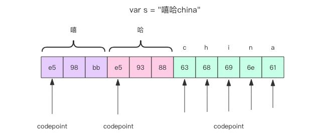

# 09String字符串

字符串通常有两种设计，一种是「字符」串，一种是「字节」串。

「字符」串中的每个字都是定长的，而「字节」串中每个字是不定长的。

Go 语言里的字符串是「字节」串，英文字符占用 1 个字节，非英文字符占多个字节。

这意味着无法通过位置来快速定位出一个完整的字符来，而必须通过遍历的方式来逐个获取单个字符。

我们所说的字符通常是指 unicode 字符，你可以认为所有的英文和汉字在 unicode 字符集中都有一个唯一的整数编号，一个 unicode 通常用 4 个字节来表示，对应的 Go 语言中的字符 rune 占 4 个字节。在 Go 语言的源码中可以找到下面这行代码，rune 类型是一个衍生类型，它在内存里面使用 int32 类型的 4 个字节存储。

```go
type rune int32
```

使用「字符」串来表示字符串势必会浪费空间，因为所有的英文字符本来只需要 1 个字节来表示，用 rune 字符来表示的话那么剩余的 3 个字节都是零。但是「字符」串有一个好处，那就是可以快速定位。



其中 codepoint 是每个「字」的其实偏移量。

Go 语言的字符串采用 utf8 编码，中文汉字通常需要占用 3 个字节，英文只需要 1 个字节。len() 函数得到的是字节的数量，`通过下标来访问字符串得到的是「字节」。`


## 按字节遍历

字符串可以通过下标来访问内部字节数组具体位置上的字节，字节是 byte 类型.

```go
package main

import "fmt"

func main() {
	var s = "嘻哈China"
	for i := 0; i < len(s); i++ {
		fmt.Printf("%x ", s[i])
	}
}

/*
e5 98 bb e5 93 88 43 68 69 6e 61
*/
```

## 按字符rune遍历：

```go
package main

import "fmt"

func main() {
	var s = "嘻哈China"
	for codepoint, runeValue := range s {
		fmt.Printf("%d %d ", codepoint, int32(runeValue))
	}
}

/*
0 22075 3 21704 6 67 7 104 8 105 9 110 10 97
*/
```

对字符串进行 range 遍历，每次迭代出两个变量 codepoint 和 runeValue。codepoint 表示字符起始位置，runeValue 表示对应的 unicode 编码（类型是 rune)。

## 字节串的内存表示

如果字符串仅仅是字节数组，那字符串的长度信息是怎么得到呢？要是字符串都是字面量的话，长度尚可以在编译期计算出来，但是如果字符串是运行时构造的，那长度又是如何得到的呢？

```go
var s1 = "hello" // 静态字面量
var s2 = ""
for i:=0;i<10;i++ {
  s2 += s1 // 动态构造
}
fmt.Println(len(s1))
fmt.Println(len(s2))
```

字符串的内存结构： 它不仅仅是前面提到的那个字节数组，编译器还为它分配了头部字段来存储长度信息和指向底层字节数组的指针，图示如下，结构非常类似于切片，区别是头部少了一个容量字段。


当我们将一个字符串变量赋值给另一个字符串变量时，底层的字节数组是共享的，它只是浅拷贝了头部字段。

## 字符串是只读的

你可以使用下标来读取字符串指定位置的字节，但是你无法修改这个位置上的字节内容。如果你尝试使用下标赋值，编译器在语法上直接拒绝你。

```go
package main

func main() {
    var s = "hello"
    s[0] = 'H'
}
--------
./main.go:5:7: cannot assign to s[0]
```

## 切割切割

字符串在内存形式上比较接近于切片，它也可以像切片一样进行切割来获取子串。子串和母串共享底层字节数组。

```go
package main

import "fmt"

func main() {
    var s1 = "hello world"
    var s2 = s1[3:8]
    fmt.Println(s2)
}

-------
lo wo
```

字符串的切割也是基于字节的切割；


## 字节切片和字符串的相互转换

在使用 Go 语言进行网络编程时，经常需要将来自网络的字节流转换成内存字符串，同时也需要将内存字符串转换成网络字节流。Go 语言直接内置了字节切片和字符串的相互转换语法。

```go
package main

import "fmt"

func main() {
	var s1 = "hello world"
	var b = []byte(s1) // 字符串转字节切片
	var s2 = string(b) // 字节切片转字符串；
	fmt.Println(b)
	fmt.Println(s2)
}
```

从节省内存的角度出发，你可能会认为字节切片和字符串的底层字节数组是共享的。但是事实不是这样的，底层字节数组会被拷贝。如果内容很大，那么转换操作是需要一定成本的。

那为什么需要拷贝呢？因为字节切片的底层数组内容是可以修改的，而字符串的底层字节数组是只读的，如果共享了，就会导致字符串的只读属性不再成立。

