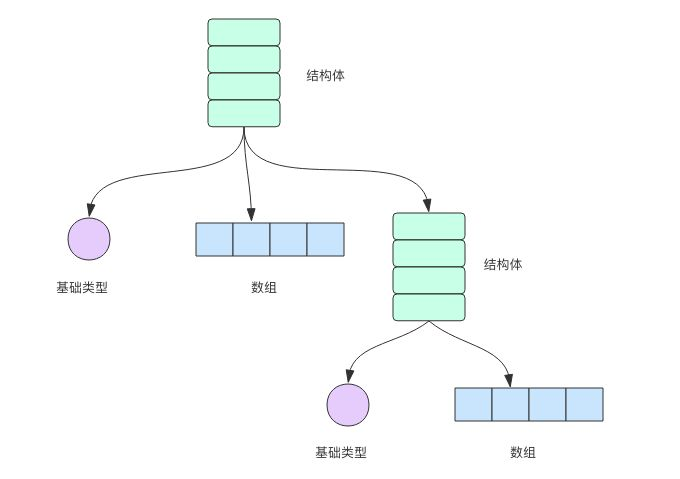

# 10Struct结构体

Go 语言在数据结构上最重要的概念 —— 结构体。

如果说 Go 语言的基础类型是原子，那么结构体就是分子。分子是原子的组合，让形式有限的基础类型变化出丰富多样的形态结构。结构体里面装的是基础类型、切片、字典、数组以及其它类型的结构体等等。



## 结构体类型的定义

结构体和其它高级语言里的「类」比较类似。下面我们使用结构体语法来定义一个「圆」型。

```go
type Circle struct {
    x int
    y int
    Radius int
}
```

Circle 结构体内部有三个变量，分别是圆心的坐标以及半径。

`特别需要注意是结构体内部变量的大小写，首字母大写是公开变量，首字母小写是内部变量，分别相当于类成员变量的 Public 和 Private 类别。内部变量只有属于同一个 package（简单理解就是同一个目录）的代码才能直接访问。`

